# SlopTweak user guide

SlopTweak rents a graphics card (GPU) on your own Vast.ai account, runs
InvokeAI on it for making and editing images, copies your images to your PC,
and shuts the GPU down when you're done. This guide covers everything from
installing to your first image.

Money questions: see **[What SlopTweak costs](costs.md)**.

*Screenshots are from a test run, so the GPU names, prices, and folder paths
on your screen will differ.*

## Contents

1. [Install](#1-install)
2. [First-time setup (about 10 minutes, once)](#2-first-time-setup)
3. [Make images](#3-make-images)
4. [Inpainting: the built-in tutorial](#4-inpainting-the-built-in-tutorial)
5. [Stop, and where your images are](#5-stop-and-where-your-images-are)
6. [Settings](#6-settings)
7. [Updates](#7-updates)
8. [When something goes wrong](#8-when-something-goes-wrong)

## 1. Install

1. Download `SlopTweak_<version>_x64-setup.exe` from the
   [latest release](https://github.com/ljohnsoncpu/SlopTweak/releases/latest).
2. Run it. If Windows says **"Windows protected your PC"**, click **More info**,
   then **Run anyway**. New apps get this warning until enough people have
   downloaded them.
3. It installs for your Windows user only (no administrator password) and adds
   SlopTweak to the Start menu.

## 2. First-time setup

The first time you open SlopTweak, a setup guide walks you through two accounts
and two keys. Each step has a button that opens the right web page.

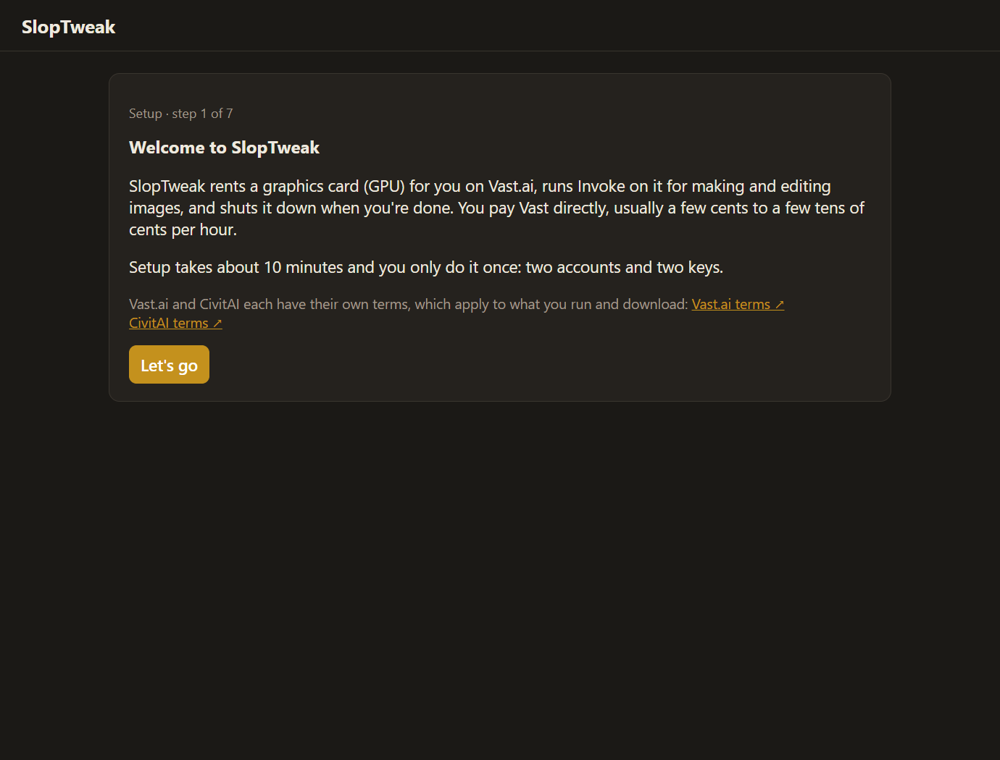

**Step 1: Create a Vast.ai account.** Sign up with your email, then click the
link in Vast's verification email. Vast won't rent you a GPU until your email is
verified.

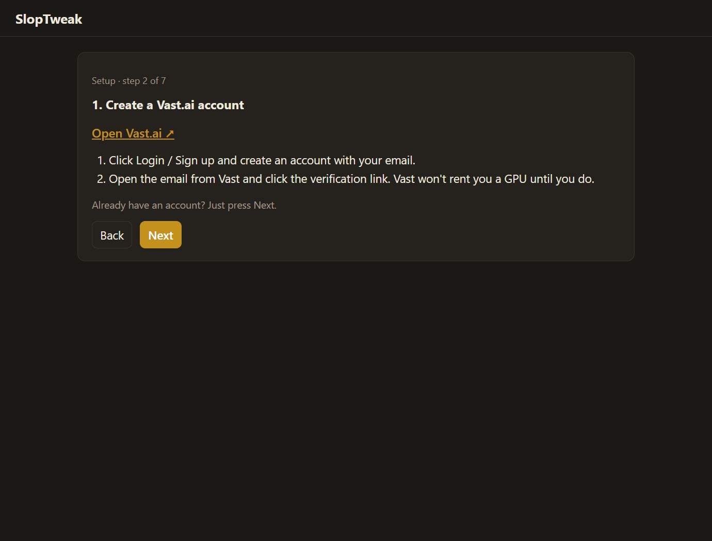

**Step 2: Add credit on Vast.** Click **Add Credit** on Vast's billing page. The
minimum is $5, which is enough for many hours (see [costs](costs.md)). Vast can
also refill your credit automatically; leave that off if you want a hard limit.

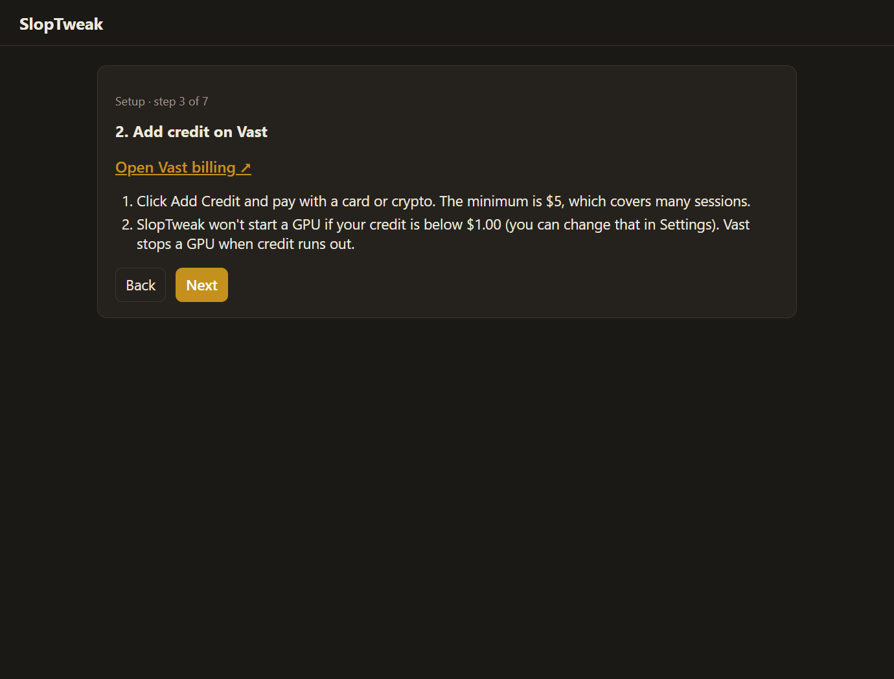

**Step 3: Connect SlopTweak to Vast.** On Vast's API keys page, click **+ New**,
name it *SlopTweak*, copy the key, and paste it into SlopTweak. It's checked
right away. When it works you'll see your credit.

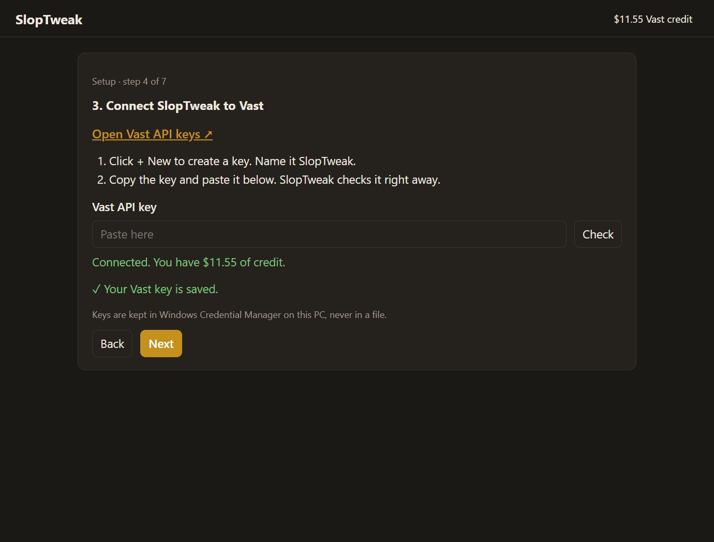

**Step 4: Create a CivitAI account** (free). CivitAI hosts many of the models.

**Step 5: Connect SlopTweak to CivitAI.** In your CivitAI account settings,
scroll to **API Keys**, click **Add API key**, name it *SlopTweak*, and paste it
in.

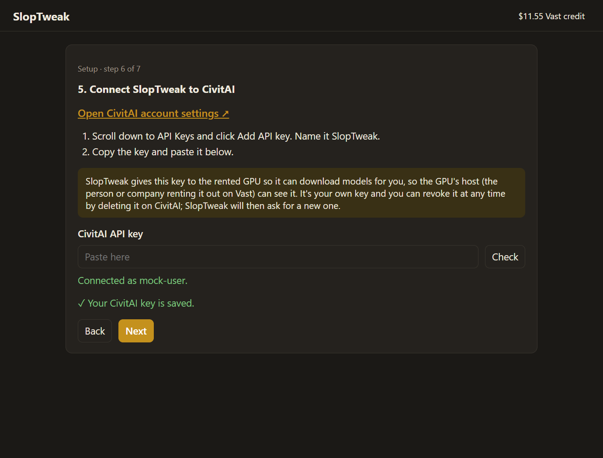

> Your CivitAI key is sent to the rented GPU so it can download models, and the
> person who owns that machine could see it. It only gives access to your CivitAI
> account (not to Vast or your card), and you can delete it on CivitAI at any
> time and make a new one.

Keys are stored in Windows Credential Manager on your PC, never in a file.

## 3. Make images

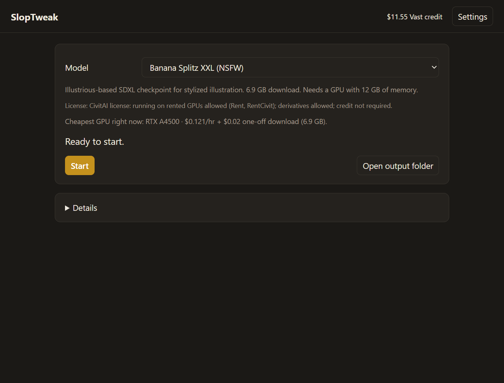

1. **Pick a model.** Each one says what it's good at, how big the download is,
   and its license. Models marked *(NSFW)* can make adult images.
2. Check the line **"Cheapest GPU right now"**: that's what you'll pay per hour,
   plus the one-off download.
3. Press **Start.** SlopTweak rents a GPU and sets it up. This usually takes 3 to
   10 minutes; a cheap machine can take up to 15. You can watch the progress:

   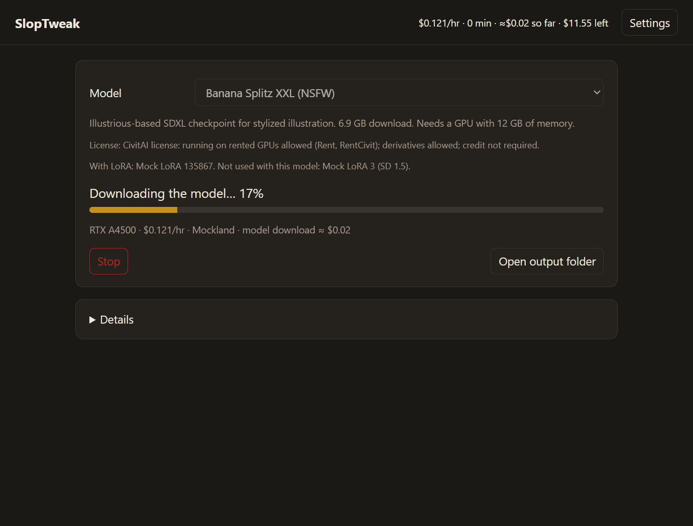

   If a machine doesn't work out, SlopTweak shuts it down and tries another (up
   to 3), so you don't pay for a broken one.
4. When it's ready, **Invoke opens in its own window.** Type what you want in the
   prompt box and press **Invoke**. New images appear in the gallery on the right.

The bar at the top of SlopTweak (and the title of the Invoke window) shows the
running cost: price per hour, how long it's been running, roughly what you've
spent, and your credit left.

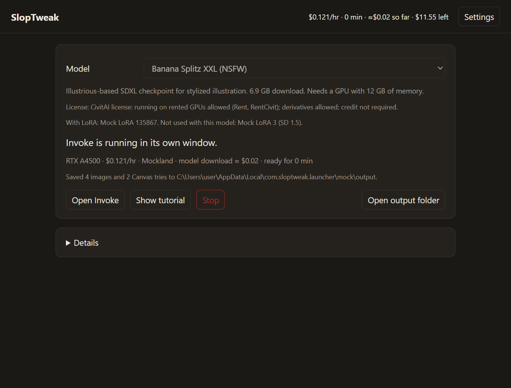

If you close the Invoke window by accident, press **Open Invoke**.

## 4. Inpainting: the built-in tutorial

The first time Invoke opens, a small guide appears in its corner. It loads a
sample picture and walks you through **inpainting**: painting over part of an
image and describing what should go there instead.

1. In the gallery, open **Assets**, right-click the sample picture, and choose
   **New Canvas from Image → As Raster Layer (Resize)**.
2. Select the **Inpaint Mask** layer, press **B** for the brush, and paint over
   the part you want to change.
3. Type what should be there (for example "a bowl of oranges") and press
   **Invoke**.
4. Press **✓ Accept** to keep the result on the canvas. To also keep it as its
   own image, use **Save To Gallery** (the floppy-disk button).

You can skip it. To see it again, press **Show tutorial** in SlopTweak.

## 5. Stop, and where your images are

Press **Stop** when you're done. SlopTweak copies any last images, then
destroys the GPU so billing stops. Closing SlopTweak does the same after asking
you:

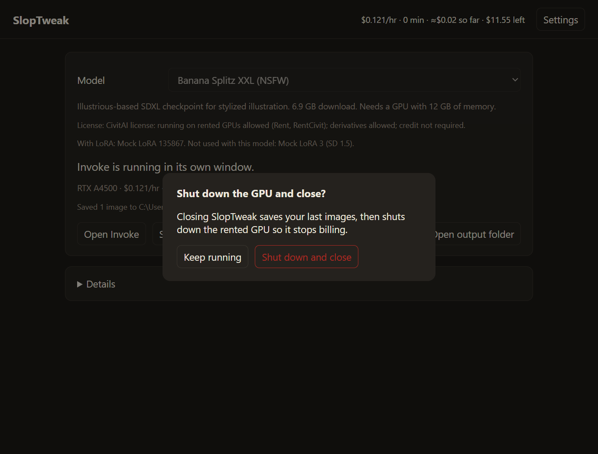

Your images are in **`Pictures\SlopTweak`** (press **Open output folder**):

- every image in Invoke's gallery, as it's made;
- every Canvas try, kept or not, in the **`Canvas`** subfolder.

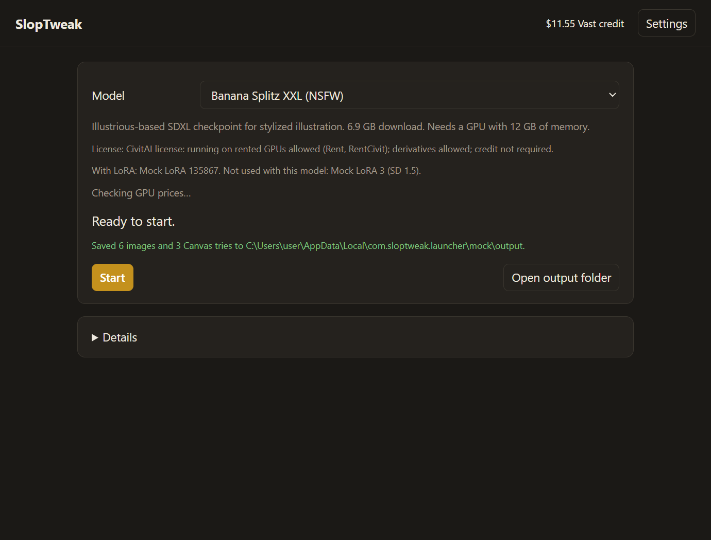

The GPU is a fresh machine every time, so anything left only in Invoke is gone
after Stop. Images already on your PC are safe.

**If you forget to stop:** the GPU shuts itself down after 20 idle minutes, after
4 hours in total, or about 10 minutes after your PC goes to sleep or offline. The
next time you open SlopTweak it checks for anything still running and offers to
shut it down.

## 6. Settings

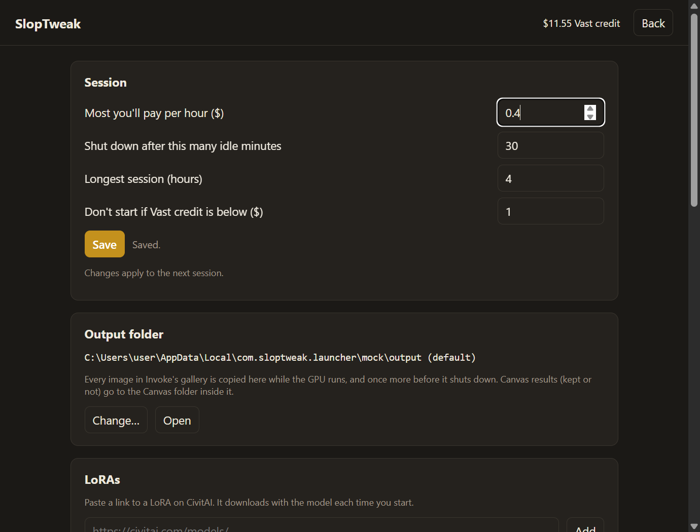

- **Most you'll pay per hour**: SlopTweak won't rent anything pricier (default
  $0.50; it usually finds $0.10 to $0.15).
- **Idle minutes / longest session**: when the GPU shuts itself down.
- **Don't start if credit is below**: the safety floor (default $1.00).
- **Output folder**: where images go.
- **LoRAs**: paste a CivitAI link to a LoRA (a small add-on that teaches a model
  a style or character). It downloads with the model each time you start. It's
  only used with models of the same family; the list says which.
- **Accounts**: change your keys, or run setup again.
- **Model list**: new models appear automatically; **Check for new models**
  fetches the list now.
- **About and help**: your version, **Check for updates**, and **Copy
  diagnostics**.

## 7. Updates

When a new version is out, the home screen offers it:

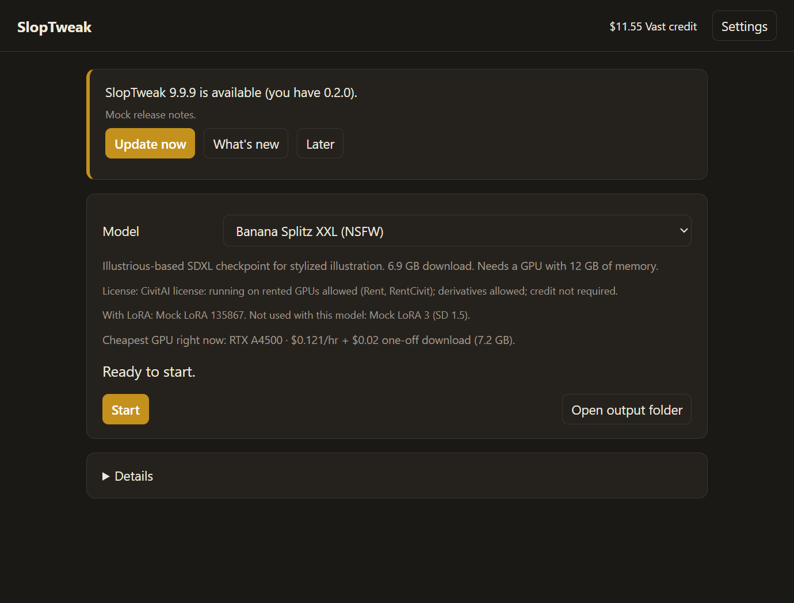

Press **Update now**. SlopTweak downloads it, checks its signature, installs it
(you'll see a short progress bar; no questions), and reopens. You can't update
while a GPU is running; stop first. **Later** hides the offer until the next
launch.

## 8. When something goes wrong

**"No GPU matches your settings right now."** All suitable GPUs are taken or cost
more than your limit. Try again in a few minutes, or raise **Most you'll pay per
hour** in Settings.

**It keeps trying and then says it couldn't get a GPU ready.** Some hosts are slow
or broken; SlopTweak shut them down for you. Press **OK** and try again later.

**"You have $x of Vast credit. SlopTweak won't start below $1.00."** Add credit on
Vast ([cloud.vast.ai/billing](https://cloud.vast.ai/billing/)), or lower the
floor in Settings.

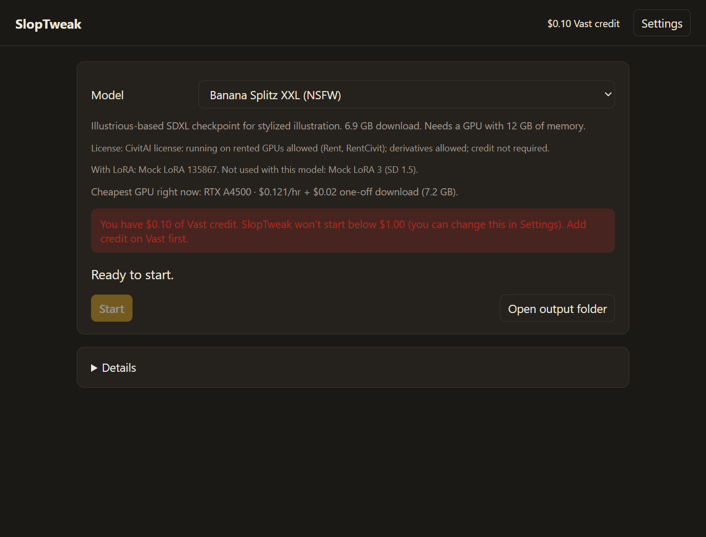

**A LoRA couldn't be set up.** Turn it off in Settings (untick it) and start again.

**"A GPU from an earlier session is still running."** SlopTweak found a GPU it
started before (for example after a crash). **Reconnect** to keep using it, or
**Shut it down**.

**Anything else:** go to **Settings → About and help → Copy diagnostics**, and
paste the report into a
[new issue](https://github.com/ljohnsoncpu/SlopTweak/issues/new) or a message to
whoever gave you SlopTweak. The report says what the app did; keys, tokens, and
your Windows user name are removed, and nothing is sent unless you paste it.

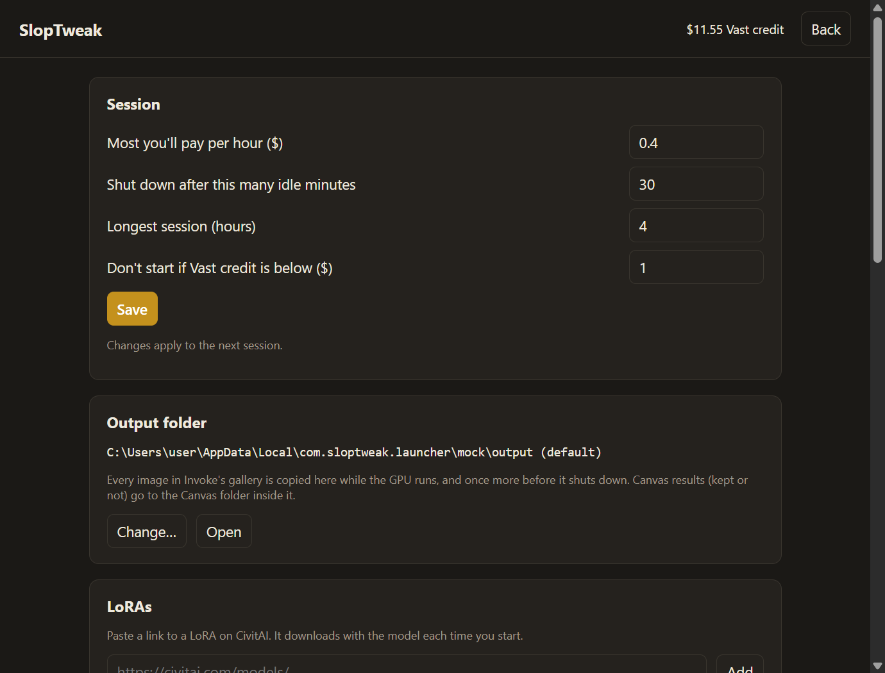

**Checking that nothing is billing:** open
[Vast's instances page](https://cloud.vast.ai/instances/). Anything listed there
is running and billing. You can destroy it there too.
