# SlopTweak user guide

SlopTweak rents a graphics card (GPU) on your own Vast.ai account, runs
InvokeAI on it for making and editing images, copies your images to your PC,
and shuts the GPU down when you're done. This guide covers everything from
installing to your first image.

Money questions: see **[What SlopTweak costs](costs.md)**.

*Screenshots are from a test run, so the GPU names, prices, and folder paths
on your screen will differ.*

## Contents

1. [Install](#1-install)
2. [First-time setup (about 10 minutes, once)](#2-first-time-setup)
3. [Make images](#3-make-images)
4. [Inpainting: the built-in tutorial](#4-inpainting-the-built-in-tutorial)
5. [Stop, and where your images are](#5-stop-and-where-your-images-are)
6. [Settings](#6-settings)
7. [Updates](#7-updates)
8. [When something goes wrong](#8-when-something-goes-wrong)
9. [Identity Edit: your own characters in new scenes](#9-identity-edit-your-own-characters-in-new-scenes)

## 1. Install

1. Download `SlopTweak_<version>_x64-setup.exe` from the
   [latest release](https://github.com/ljohnsoncpu/SlopTweak/releases/latest).
2. Run it. If Windows says **"Windows protected your PC"**, click **More info**,
   then **Run anyway**. New apps get this warning until enough people have
   downloaded them.
3. It installs for your Windows user only (no administrator password) and adds
   SlopTweak to the Start menu.

## 2. First-time setup

The first time you open SlopTweak, a setup guide walks you through two accounts
and two keys. Each step has a button that opens the right web page.

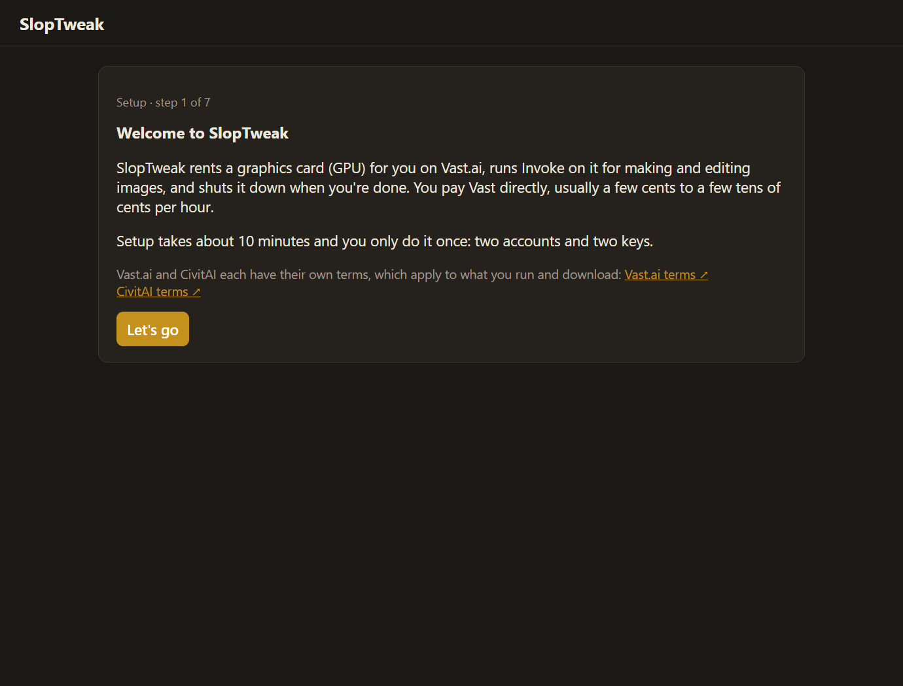

**Step 1: Create a Vast.ai account.** Sign up with your email, then click the
link in Vast's verification email. Vast won't rent you a GPU until your email is
verified.

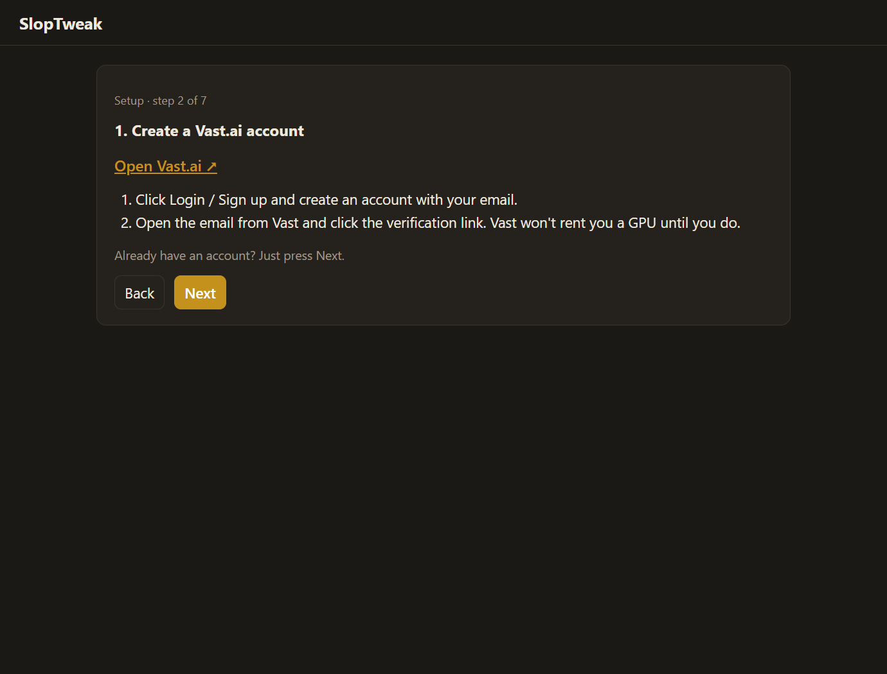

**Step 2: Add credit on Vast.** Click **Add Credit** on Vast's billing page. The
minimum is $5, which is enough for many hours (see [costs](costs.md)). Vast can
also refill your credit automatically; leave that off if you want a hard limit.

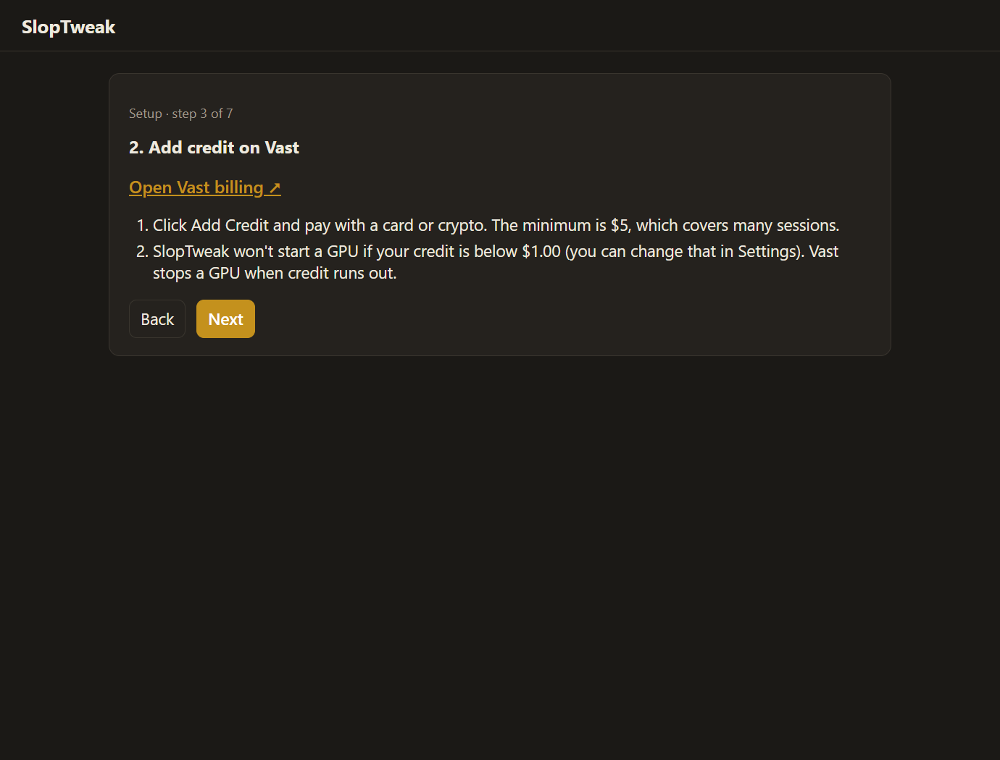

**Step 3: Connect SlopTweak to Vast.** On Vast's API keys page, click **+ New**,
name it *SlopTweak*, copy the key, and paste it into SlopTweak. It's checked
right away. When it works you'll see your credit.

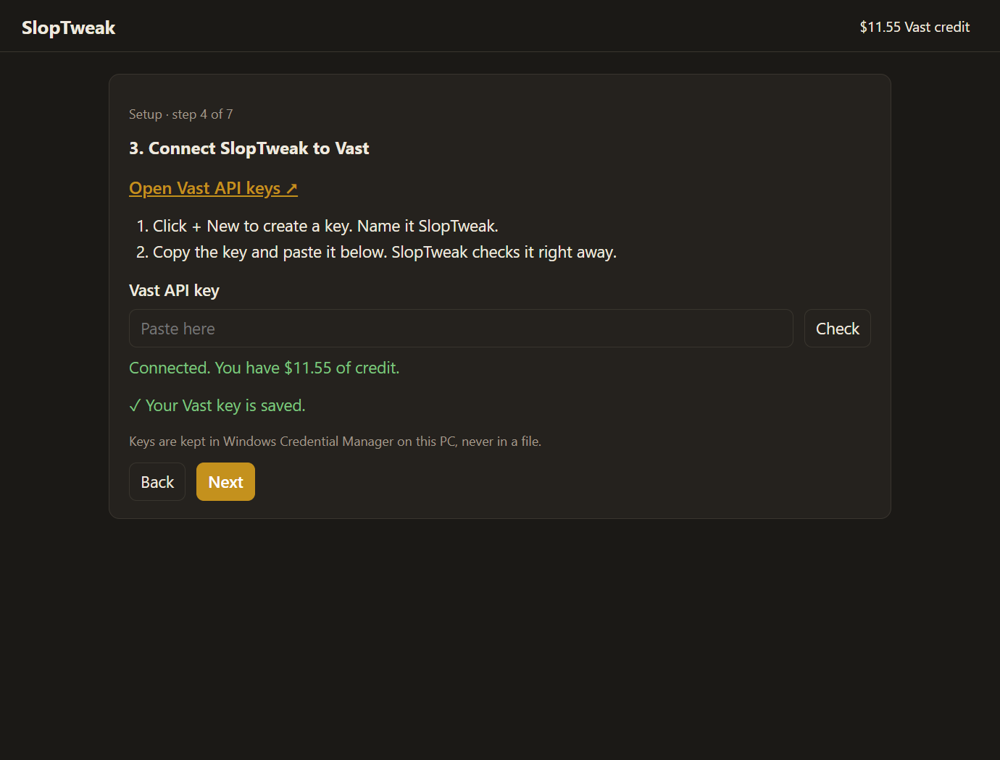

**Step 4: Create a CivitAI account** (free). CivitAI hosts many of the models.

**Step 5: Connect SlopTweak to CivitAI.** In your CivitAI account settings,
scroll to **API Keys**, click **Add API key**, name it *SlopTweak*, and paste it
in.

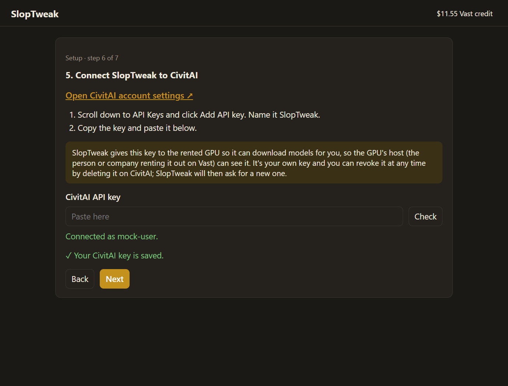

> Your CivitAI key is sent to the rented GPU so it can download models, and the
> person who owns that machine could see it. It only gives access to your CivitAI
> account (not to Vast or your card), and you can delete it on CivitAI at any
> time and make a new one.

Keys are stored in Windows Credential Manager on your PC, never in a file.

## 3. Make images

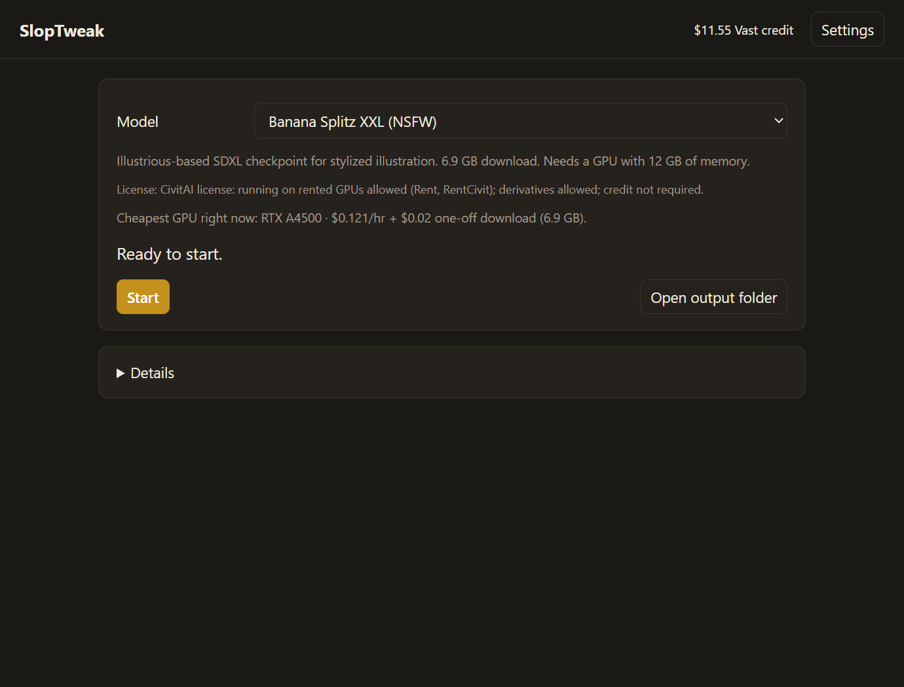

1. **Pick a model.** Each one says what it's good at, how big the download is,
   and its license. Models marked *(NSFW)* can make adult images.
2. Check the line **"Cheapest GPU right now"**: that's what you'll pay per hour,
   plus the one-off download.
3. Press **Start.** SlopTweak rents a GPU and sets it up. This usually takes 3 to
   10 minutes; a cheap machine can take up to 15. You can watch the progress:

   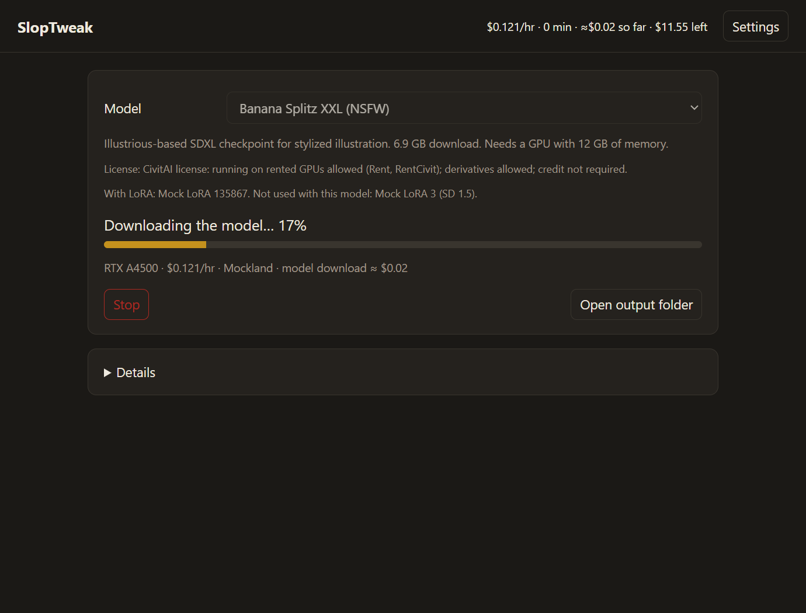

   If a machine doesn't work out, SlopTweak shuts it down and tries another (up
   to 3), so you don't pay for a broken one.
4. When it's ready, **Invoke opens in its own window.** Type what you want in the
   prompt box and press **Invoke**. New images appear in the gallery on the right.

The bar at the top of SlopTweak (and the title of the Invoke window) shows the
running cost: price per hour, how long it's been running, roughly what you've
spent, and your credit left.

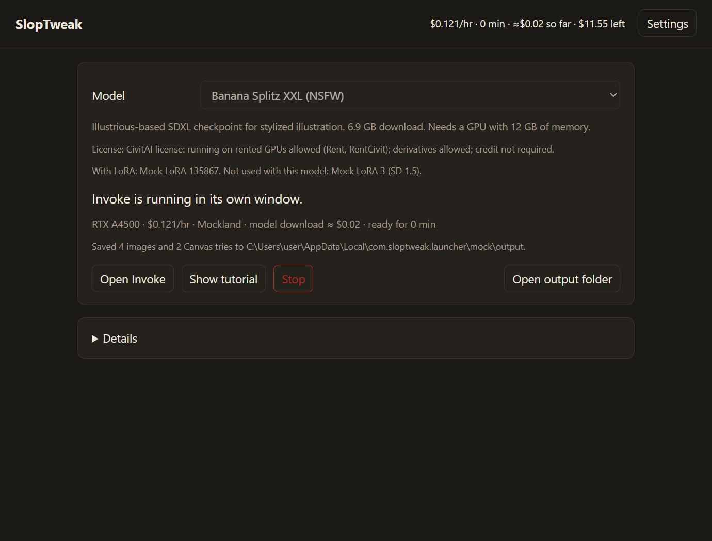

When you close the Invoke window, SlopTweak asks whether to stop renting the
GPU too. **Yes** (the default) stops it and saves your images; **No** keeps it
running, and **Open Invoke** brings the window back.

## 4. The built-in tutorial

The first time Invoke opens, a guide appears in the middle of its window. After
the first step it moves to the bottom-right corner; drag it by its title line if
it's in the way. A blue outline marks what to click next. It has five short
stages, all with the same character:

1. **Prompting.** Make the character in the **Generate** tab. The prompt is a
   plain sentence, then tags; the **negative prompt** (`nsfw`) says what you
   don't want.
2. **Prompt Templates.** Save the tags a model likes (from its page) as a
   template, with `{prompt}` where your own words go.
3. **To the canvas.** Right-click your picture in the gallery →
   **New Canvas from Image → As Raster Layer (Resize)**. Don't like yours?
   **Use ours instead** loads a ready-made one.
4. **Fix the eyes.** Paint a mask over the eyes, press **Shift+B** to fit the
   box to it, widen the box to the face, and try a low and then a higher
   **Denoising Strength**. **Accept** the one you like.
5. **A see-through visor.** Paint a blue band on a new layer, lower its
   **Opacity**, mask it, describe the visor, and use a high denoise. Accept
   doesn't put the picture in the gallery: use **Save To Gallery**.

The last step links to Invoke's own guides (layers, the bounding box, prompts,
shortcuts, videos); they open in your browser.

You can leave between stages: SlopTweak remembers where you were, even on
your next GPU. You can skip it or minimize it. To see it again, press
**Show tutorial** in SlopTweak.

### Prompt templates and workflows

Most models come with **prompt templates** (Invoke's template picker, next to
the prompt box), made from the example pictures on the model's page. Pick one
and your prompt is dropped into it.

Templates and workflows you make or change in Invoke are saved on your PC while
you work and when you Stop, and put back on the next GPU. Delete one in Invoke
and it's gone for good, built-in ones included.

## 5. Stop, and where your images are

Press **Stop** when you're done. SlopTweak copies any last images, then
destroys the GPU so billing stops. Closing SlopTweak does the same after asking
you:

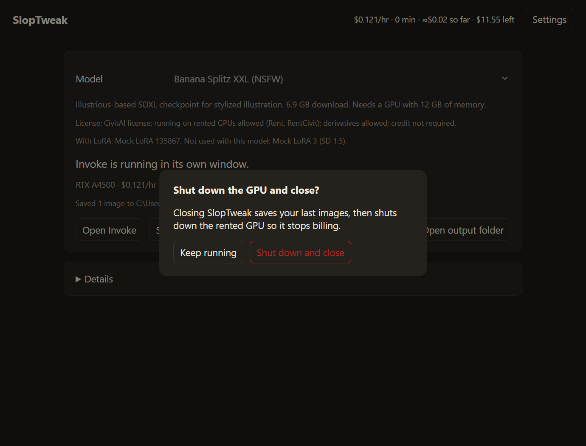

Your images are in **`Pictures\SlopTweak`** (press **Open output folder**):

- every image in Invoke's gallery, as it's made;
- every Canvas try, kept or not, in the **`Canvas`** subfolder.

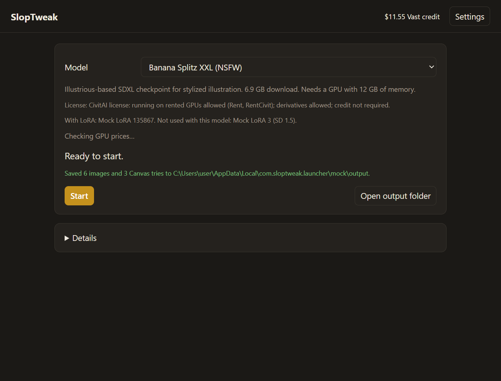

The GPU is a fresh machine every time, so anything left only in Invoke is gone
after Stop, except your templates and workflows (see above). Images already on
your PC are safe.

**If you forget to stop:** the GPU shuts itself down after 20 idle minutes, after
4 hours in total, or about 10 minutes after your PC goes to sleep or offline. The
next time you open SlopTweak it checks for anything still running and offers to
shut it down.

## 6. Settings

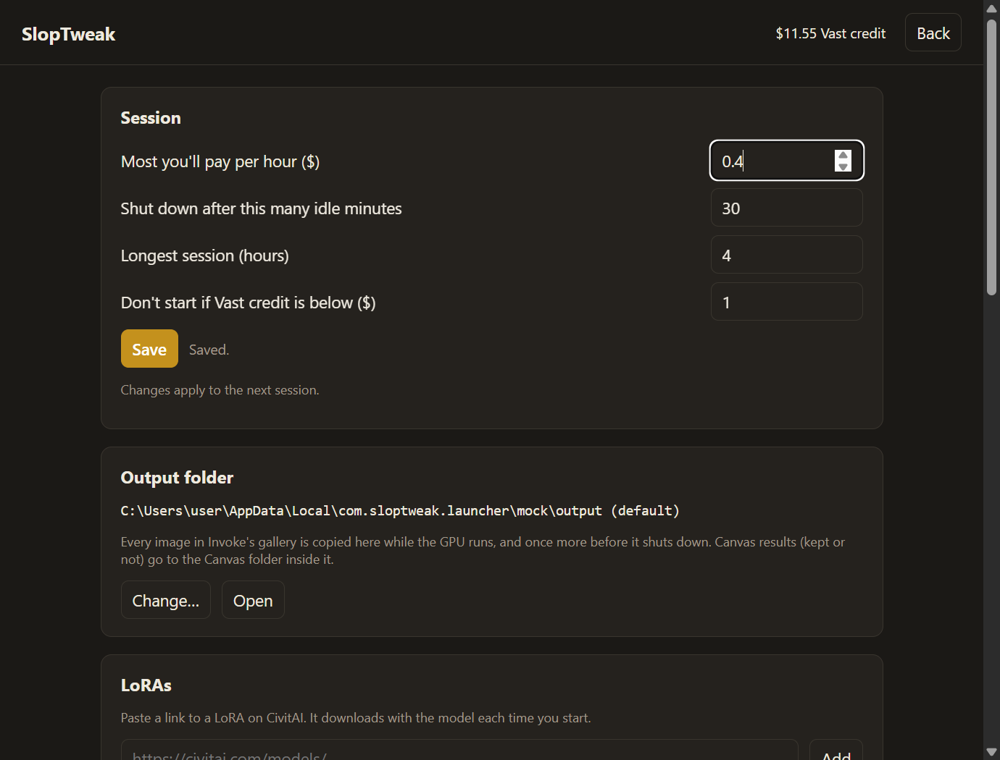

- **Most you'll pay per hour**: SlopTweak won't rent anything pricier (default
  $0.50; it usually finds $0.10 to $0.15).
- **Idle minutes / longest session**: when the GPU shuts itself down.
- **Don't start if credit is below**: the safety floor (default $1.00).
- **Output folder**: where images go.
- **LoRAs**: paste a CivitAI link to a LoRA (a small add-on that teaches a model
  a style or character). It downloads with the model each time you start. It's
  only used with models of the same family; the list says which.
- **Accounts**: change your keys, or run setup again.
- **Model list**: new models appear automatically; **Check for new models**
  fetches the list now.
- **About and help**: your version, **Check for updates**, and **Copy
  diagnostics**.

## 7. Updates

When a new version is out, the home screen offers it:

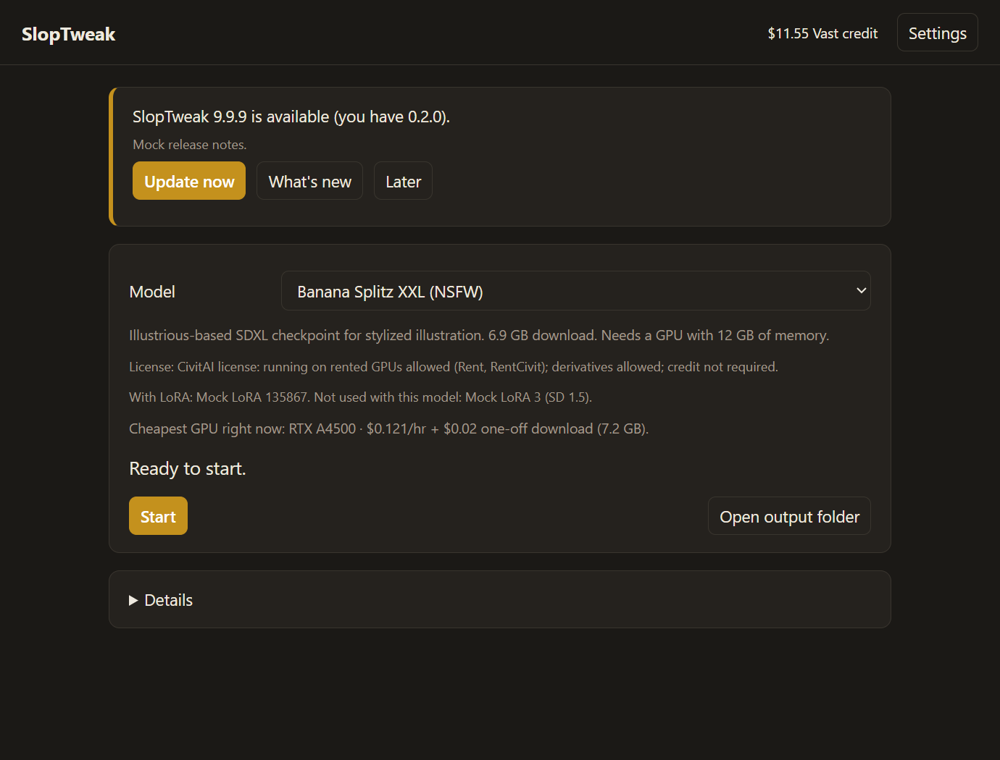

Press **Update now**. SlopTweak downloads it, checks its signature, installs it
(you'll see a short progress bar; no questions), and reopens. You can't update
while a GPU is running; stop first. **Later** hides the offer until the next
launch.

## 8. When something goes wrong

**"No GPU matches your settings right now."** All suitable GPUs are taken or cost
more than your limit. Try again in a few minutes, or raise **Most you'll pay per
hour** in Settings.

**It keeps trying and then says it couldn't get a GPU ready.** Some hosts are slow
or broken; SlopTweak shut them down for you. Press **OK** and try again later.

**"You have $x of Vast credit. SlopTweak won't start below $1.00."** Add credit on
Vast ([cloud.vast.ai/billing](https://cloud.vast.ai/billing/)), or lower the
floor in Settings.

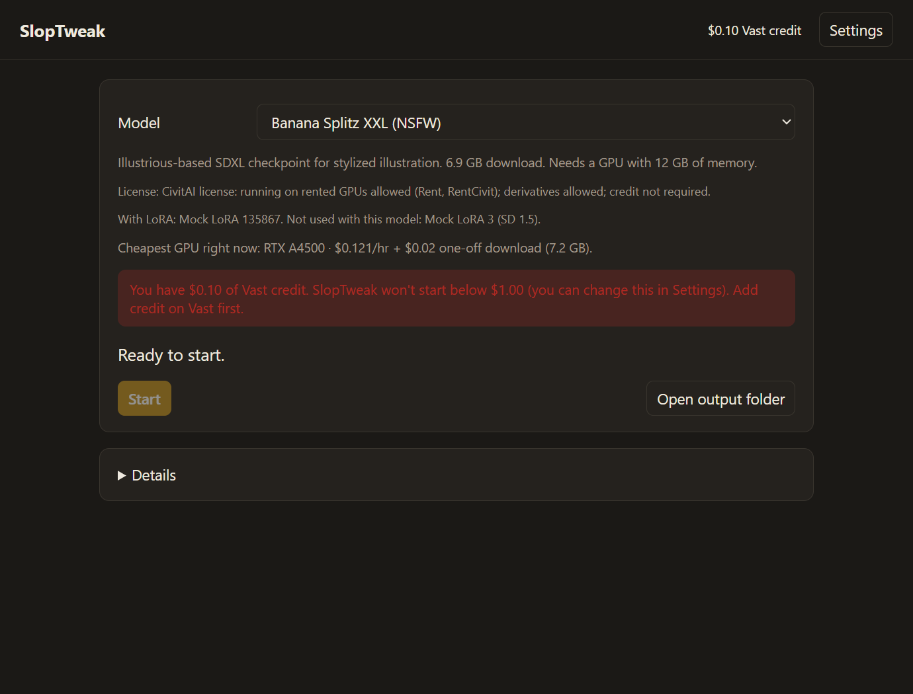

**A LoRA couldn't be set up.** Turn it off in Settings (untick it) and start again.

**"A GPU from an earlier session is still running."** SlopTweak found a GPU it
started before (for example after a crash). **Reconnect** to keep using it, or
**Shut it down**.

**Anything else:** go to **Settings → About and help → Copy diagnostics**, and
paste the report into a
[new issue](https://github.com/ljohnsoncpu/SlopTweak/issues/new) or a message to
whoever gave you SlopTweak. The report says what the app did; keys, tokens, and
your Windows user name are removed, and nothing is sent unless you paste it.

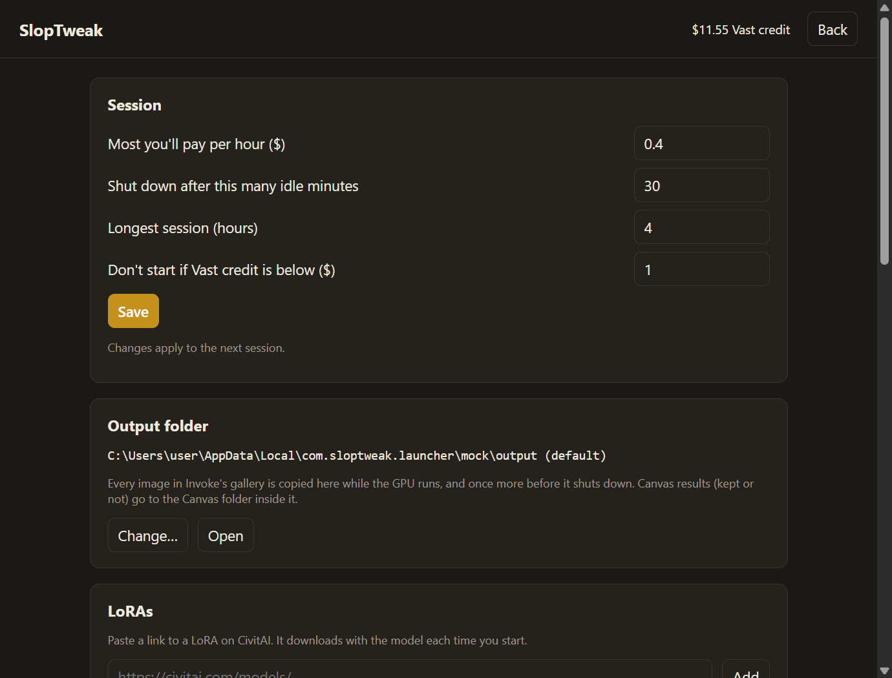

**Checking that nothing is billing:** open
[Vast's instances page](https://cloud.vast.ai/instances/). Anything listed there
is running and billing. You can destroy it there too.

## 9. Identity Edit: your own characters in new scenes

Pick **Wulver Identity Edit** instead of a regular model. It rents a bigger GPU
(32 GB or more, about $0.55-0.70 an hour) and the setup downloads about 33 GB,
so the first start can take 10 to 15 minutes. It doesn't open Invoke: SlopTweak
shows its own **Identity Edit** panel under the status line.

1. **Add a character.** Press *Character 1…* and choose a picture of your
   character (a PNG, JPEG or WebP, up to 15 MB). A clean full-body picture on a
   plain background works best. You can add a second character the same way.
2. **Say what they're doing**, for example "they sit together at a sunny café
   table, laughing". Describe the scene; the characters' looks come from the
   pictures.
3. Pick a **shape** (square, tall or wide) and press **Make image**. It takes
   about 30 to 60 seconds once the model is loaded; the first image takes
   longer.
4. Every finished image is shown under the button **and** saved to your output
   folder as it appears (and once more before the GPU shuts down), just like
   Invoke's images. *Use as character 1/2* puts a result back in a slot so you
   can keep going from it.

### Editing a picture
Set **I want to** to *Edit a picture* to change an image you already have instead
of making a new one:

1. Press *Picture to edit…* and choose the image (PNG, JPEG or WebP, up to 15 MB).
2. Optionally add a *character sheet* too; the edit can pull the character's look
   from it.
3. Say what should change, for example "change the jacket into a red hoodie, keep
   everything else the same", and press **Edit image**.

The result keeps the picture's shape (there is no Shape menu in this mode) and
usually its scene and characters. The whole image is redrawn, so small details can
drift, and large changes such as turning day into night alter the lighting a lot.
Your words win over a character sheet: if the sheet shows a green jacket and you
ask for a red hoodie, you get the hoodie. *Edit this image* under a result sends
it back in to be edited again.

**How much to change.** The slider under the pictures goes from *Stay close* to
*Follow my words*. At the right end (the default) the picture is redrawn from your
words. Moving it left starts from your picture instead, so it changes less, but it
follows your words less closely.

**Paint just the part to change.** *Paint the area to change…* opens your picture
full size: paint over what should change (the brush size, Undo, Erase and Clear are
under it) and press Done. Only that area is redrawn; the rest of the picture keeps
its exact pixels, and the result is saved at your picture's own size. With *Zoom in
on the painted area* ticked (the default), a small area is cut out, redrawn at much
higher detail, and put back. That's the way to fix a face or hands without changing
the style of everything else. Painting again, or choosing another picture, replaces
the painted area.

**Pictures.** Click any picture to see it bigger; right-click copies it. A result's
zoomed view also has *Save to Downloads*. To add a picture, drag a file onto its box
or copy an image and press Ctrl+V.

Notes: *Cancel* stops an image that's running. **Stop** works as always: it saves
what's left and shuts the GPU down, so nothing keeps billing. The Invoke-only
parts of SlopTweak (the tutorial, templates, workflows and your CivitAI LoRAs)
don't apply to Identity Edit.

### Advanced: ComfyUI's own interface
While an Identity Edit GPU is ready, **Open ComfyUI (advanced)** opens ComfyUI's
node editor in its own window, with the *SlopTweak Identity Edit* workflow in
its Workflows list. No extra node packs and no ComfyUI-Manager are installed,
so only what Identity Edit ships with is available. Images you save with a
*Save Image* node are synced to your output folder like the panel's results
(use plain folder names: letters, digits, `-`, `_`, `.`; *Preview Image* results
aren't saved). The GPU keeps billing while a long job runs, and closing the
window asks whether to stop it, as with Invoke.
